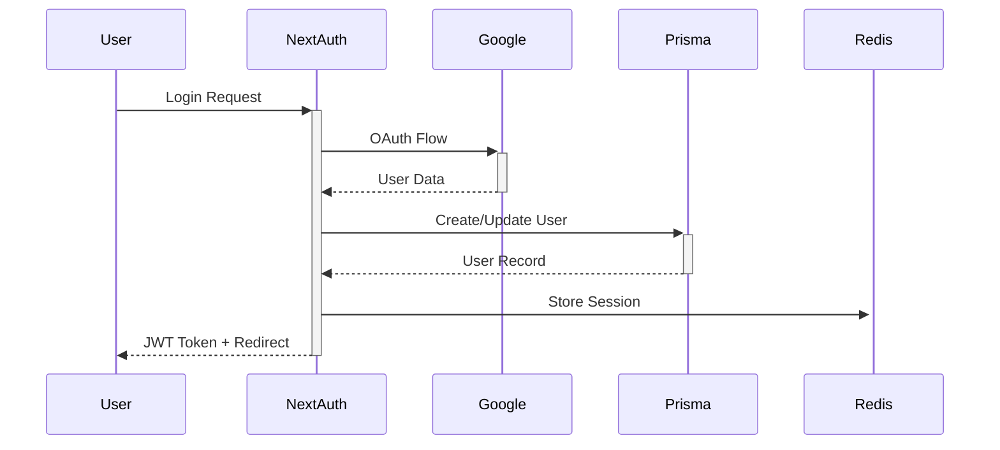
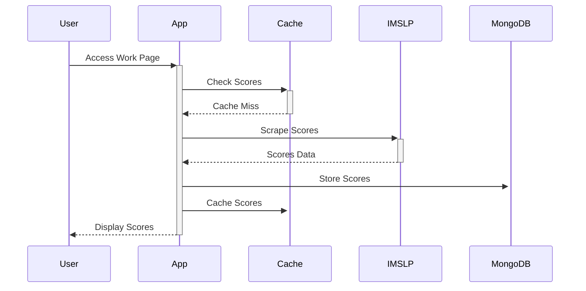
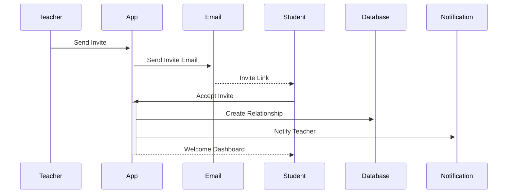

# Arquitetura Completa do Sistema - Opus Atlas

Este documento detalha a arquitetura técnica completa do Opus Atlas, incluindo todos os sistemas, módulos, fluxos e relacionamentos.

## Visão Geral da Arquitetura

### Métricas do Sistema

- **247 páginas** implementadas
- **124 rotas de API** funcionais
- **41 tabelas** no banco de dados
- **28 sistemas principais** integrados
- **47 mini-sistemas** de suporte

### Stack Tecnológico

- **Frontend/Backend**: Next.js 15.3.2 (Full-stack)
- **Database**: MongoDB 7.0 (Replica Set)
- **Cache**: Redis 7.2
- **ORM**: Prisma 6.13.0
- **Containerização**: Docker + Docker Compose
- **Infraestrutura**: Nginx + Ubuntu 24.04.3

---

## 1. Arquitetura de Alto Nível

```
┌─────────────────────────────────────────────────────────────────┐
│                         OPUS ATLAS                              │
│                    Plataforma Educacional                       │
└─────────────────────────────────────────────────────────────────┘
                                │
                ┌───────────────▼───────────────┐
                │        CLOUDFLARE CDN         │
                │    DDoS + SSL + Caching      │
                └───────────────┬───────────────┘
                                │
                ┌───────────────▼───────────────┐
                │         NGINX PROXY           │
                │  Load Balancer + SSL Term     │
                └───────────────┬───────────────┘
                                │
        ┌───────────────────────▼───────────────────────┐
        │              NEXT.JS APPLICATION              │
        │                                               │
        │  ┌─────────────┐ ┌─────────────┐ ┌─────────────┐│
        │  │   PUBLIC    │ │  PROTECTED  │ │   ADMIN     ││
        │  │  (23 pages) │ │ (15 pages)  │ │ (35 pages)  ││
        │  └─────────────┘ └─────────────┘ └─────────────┘│
        │                                               │
        │  ┌─────────────┐ ┌─────────────┐               │
        │  │   TEACHER   │ │   STUDENT   │               │
        │  │ (18 pages)  │ │ (12 pages)  │               │
        │  └─────────────┘ └─────────────┘               │
        └───────────────────────┬───────────────────────┘
                                │
        ┌───────────────────────▼───────────────────────┐
        │                API LAYER                      │
        │             (124 rotas)                       │
        │                                               │
        │ ┌────────┐ ┌────────┐ ┌────────┐ ┌────────┐    │
        │ │ Auth   │ │Content │ │Teacher │ │ Admin  │    │
        │ │(7 APIs)│ │(35 APIs)│ │(20 APIs)│(35 APIs)│    │
        │ └────────┘ └────────┘ └────────┘ └────────┘    │
        └───────────────────────┬───────────────────────┘
                                │
        ┌───────────────────────▼───────────────────────┐
        │              DATA LAYER                       │
        │                                               │
        │  ┌──────────────┐    ┌──────────────┐          │
        │  │   MongoDB    │    │    Redis     │          │
        │  │ (41 tables)  │    │   (Cache)    │          │
        │  │ Replica Set  │    │   Sessions   │          │
        │  └──────────────┘    └──────────────┘          │
        └───────────────────────────────────────────────┘
```

---

## 2. Módulos e Sistemas Principais

### 2.1 Sistema Público (23 páginas)

#### Navegação e Conteúdo

```
┌── / (Homepage)
├── /about-us
├── /contact
├── /help
├── /faq
├── /support
├── /terms
├── /privacy
└── /copyright

┌── /music-history
├── /instruments
├── /composers
├── /composer/[id]
├── /works
├── /works/[id]
├── /genres
└── /difficulty
```

**Funcionalidades:**

- Catálogo completo: 19.177 compositores + 207.883 obras
- Sistema de busca avançada com filtros
- Scraping automático IMSLP
- Player de áudio/vídeo integrado
- Sistema de cache inteligente

### 2.2 Sistema Protegido (15 páginas)

#### Área do Usuário

```
┌── /profile (6 abas)
│   ├── Informações pessoais
│   ├── Meus instrumentos
│   ├── Preferências musicais
│   ├── Privacidade
│   ├── Configurações da conta
│   └── Zona de perigo

├── /favorites (3 abas)
│   ├── Compositores
│   ├── Obras
│   └── Partituras

├── /learning (2 abas)
│   ├── Quero aprender
│   └── Já aprendi

├── /annotations (3 abas)
│   ├── Todas
│   ├── Públicas
│   └── Privadas

└── /uploads
    ├── /history
    ├── /composer/[id]/edit
    ├── /work/[id]/edit
    └── /score/[id]/edit
```

**Funcionalidades:**

- Sistema de favoritos com 3 tipos
- Milestone tracking personalizado
- Upload de vídeos de performance
- Sistema de conquistas (75 badges)
- Anotações públicas/privadas

### 2.3 Sistema Professor (18 páginas)

#### Dashboard e Gestão

```
┌── /teacher (Dashboard)
├── /teacher/students
│   └── /teacher/students/[id]
├── /teacher/lessons
│   ├── /teacher/lessons/[id]
│   └── /teacher/lessons/create
├── /teacher/calendar
├── /teacher/assignments
│   ├── /teacher/assignments/[id]
│   ├── /teacher/assignments/[id]/edit
│   └── /teacher/assignments/create
├── /teacher/profile
├── /teacher/history
└── /teacher/notifications
```

**Funcionalidades:**

- Sistema completo professor-aluno
- Agendamento com recorrência
- Criação e correção de tarefas
- Relatórios de progresso
- Calendário integrado

### 2.4 Sistema Aluno (12 páginas)

#### Área de Estudos

```
┌── /student (Dashboard)
├── /student/lessons
│   └── /student/lessons/[id]
├── /student/calendar
├── /student/assignments
│   └── /student/assignments/[id]
├── /student/progress
├── /student/history
├── /student/profile
├── /student/notifications
└── /student/review
```

**Funcionalidades:**

- Dashboard de progresso
- Upload de vídeos de tarefas
- Sistema de milestone tracking
- Avaliação de professores
- Notificações inteligentes

### 2.5 Sistema Admin (35 páginas)

#### Gestão Completa

```
┌── /admin (Dashboard)
├── /admin/analytics
├── /admin/insights (IA)

├── /admin/users
│   └── /admin/users/list

├── /admin/composers
├── /admin/works
├── /admin/scores
├── /admin/uploads

├── /admin/newsletter
│   ├── /admin/newsletter/subscribers
│   ├── /admin/newsletter/campaigns
│   ├── /admin/newsletter/templates
│   ├── /admin/newsletter/analytics
│   └── /admin/newsletter/test-lists

├── /admin/moderation
│   └── /admin/moderation/moderate

├── /admin/reports-metric
├── /admin/backup
├── /admin/system
├── /admin/ads
└── /admin/orphan-files
```

**Funcionalidades:**

- Analytics com IA
- Sistema de moderação
- Newsletter automática
- Backup inteligente
- Gestão de publicidade

---

## 3. Arquitetura de Dados

### 3.1 Schema do Banco (41 tabelas)

#### Usuários e Autenticação (4 tabelas)

```sql
User                 -- Dados principais dos usuários
Account              -- Contas OAuth (Google, etc.)
Session              -- Sessões ativas
UserToken            -- Tokens de verificação/reset
```

#### Conteúdo Musical (7 tabelas)

```sql
Composer             -- Compositores (19.177 registros)
Work                 -- Obras musicais (207.883 registros)
WorkScore            -- Partituras das obras
Epoch                -- Períodos históricos (9 registros)
Role                 -- Papéis dos compositores
Instrument           -- Instrumentos (79 registros)
WorkGenre            -- Gêneros musicais
```

#### Sistema de Favoritos (4 tabelas)

```sql
FavoriteWork         -- Obras favoritas
FavoriteComposer     -- Compositores favoritos
FavoriteScore        -- Partituras específicas favoritas
ScoreFavoriteStats   -- Estatísticas de favoritos
```

#### Sistema de Aprendizado (3 tabelas)

```sql
WantToLearn          -- Lista "Quero Aprender"
Learned              -- Lista "Já Aprendi"
UserInstrument       -- Instrumentos do usuário
```

#### Sistema de Anotações (3 tabelas)

```sql
Annotation           -- Anotações simples
WorkAnnotation       -- Anotações avançadas da comunidade
AnnotationHelpfulVote -- Votos em anotações
```

#### Sistema Professor-Aluno (6 tabelas)

```sql
Teacher              -- Perfis de professores
Student              -- Perfis de alunos
TeacherStudent       -- Relacionamento professor-aluno
Lesson               -- Aulas agendadas
Assignment           -- Tarefas/assignments
TeacherReview        -- Avaliações de professores
```

#### Sistema de Gamificação (2 tabelas)

```sql
UserAchievement      -- Conquistas desbloqueadas
AchievementProgress  -- Progresso das conquistas
```

#### Sistema de Notificações (2 tabelas)

```sql
Notification         -- Notificações do usuário
SchoolActivity       -- Atividades educacionais
```

#### Sistema de Newsletter (5 tabelas)

```sql
NewsletterSubscriber -- Assinantes
NewsletterTemplate   -- Templates de email
NewsletterCampaign   -- Campanhas
NewsletterCampaignSend -- Registro de envios
NewsletterEmailEvent -- Eventos de email
TestEmailList        -- Listas de teste
```

#### Sistema de Publicidade (2 tabelas)

```sql
Advertisement        -- Anúncios
AdStats              -- Estatísticas de anúncios
```

#### Sistema de Moderação (2 tabelas)

```sql
UploadHistory        -- Histórico de uploads
UploadModeration     -- Reports e moderação
```

### 3.2 Relacionamentos Principais

#### Cascade Deletes (Críticos)

```
User CASCADE:
├── Account (OAuth)
├── Session
├── UserToken
├── UserInstrument
├── Annotation
├── FavoriteWork/Composer/Score
├── WantToLearn/Learned
├── WorkAnnotation
├── AnnotationHelpfulVote
├── Teacher/Student (perfis)
├── Notification
├── SchoolActivity
├── UserAchievement
└── AchievementProgress

Composer CASCADE:
└── Work (obras do compositor)

Work CASCADE:
└── WorkScore (partituras da obra)
```

#### SetNull (Preservação)

```
User SetNull:
├── createdWorks (mantém obras se usuário deletado)
├── createdComposers (mantém compositores)
└── createdScores (mantém partituras)
```

---

## 4. Sistemas Principais Detalhados

### 4.1 Sistema de Autenticação

```typescript
interface AuthSystem {
  providers: ['google', 'email'];
  strategies: ['jwt', 'oauth'];
  features: [
    'email_verification',
    'password_reset',
    'two_factor_optional',
    'session_management',
  ];
}
```

**Fluxo de Autenticação:**

1. Usuário escolhe login (Google OAuth ou email/senha)
2. NextAuth.js processa autenticação
3. Session criada no Redis (TTL: 30 dias)
4. JWT token gerado com user ID e role
5. Middleware protege rotas baseado em role

### 4.2 Sistema de Scraping IMSLP

```typescript
interface ScrapingSystem {
  trigger: 'on_demand' | 'scheduled';
  sources: ['imslp.org'];
  caching: 'permanent_with_redis';
  processing: 'background_queue';
}
```

**Fluxo de Scraping:**

1. Usuário acessa obra pela primeira vez
2. Sistema verifica cache (Redis + MongoDB)
3. Se não cached, inicia scraping IMSLP
4. Extrai metadados + URLs de partituras
5. Salva primeiras 5 partituras por tipo
6. Continua processamento em background
7. Armazena permanentemente no MongoDB

### 4.3 Sistema de Favoritos

```typescript
interface FavoriteSystem {
  types: ['composer', 'work', 'score'];
  features: [
    'quick_access',
    'statistics_dashboard',
    'achievement_integration',
    'export_capability',
  ];
}
```

**Tipos de Favoritos:**

- **Compositores**: Seguir compositores preferidos
- **Obras**: Marcar obras como favoritas
- **Partituras Específicas**: Favoritar versões específicas

### 4.4 Sistema de Aprendizado

```typescript
interface LearningSystem {
  lists: ['want_to_learn', 'learned'];
  features: [
    'milestone_tracking',
    'video_upload',
    'progress_analytics',
    'goal_setting',
  ];
}
```

**Milestone Tracking por Instrumento:**

```typescript
const pianMilestones = [
  { id: 'left_hand', weight: 15, name: 'Aprendeu mão esquerda' },
  { id: 'right_hand', weight: 15, name: 'Aprendeu mão direita' },
  { id: 'hands_together', weight: 20, name: 'Tocou mãos juntas' },
  { id: 'with_metronome', weight: 20, name: 'Tocou com metrônomo' },
  { id: 'memorized', weight: 15, name: 'Memorizou a peça' },
  { id: 'performed', weight: 15, name: 'Apresentou para outros' },
];
```

### 4.5 Sistema de Gamificação

```typescript
interface GamificationSystem {
  badges: 75;
  categories: [
    'learning', // Baseado em "quero aprender"/"já aprendi"
    'favorites', // Baseado na quantidade de favoritos
    'annotations', // Baseado na criação de anotações
    'social', // Baseado em interações
    'consistency', // Baseado em streaks
  ];
}
```

**Sistema de XP:**

- Cada ação gera XP automaticamente
- Cache de XP total do usuário
- Níveis baseados em XP acumulado

### 4.6 Sistema Professor-Aluno

```typescript
interface TeacherStudentSystem {
  workflow: [
    'teacher_invite',
    'student_accept',
    'relationship_setup',
    'lesson_management',
    'assignment_tracking',
  ];
}
```

**Fluxo Completo:**

1. Professor envia convite (email + token)
2. Aluno aceita/recusa via link
3. Configuração da relação (frequência, duração, objetivos)
4. Agendamento de aulas (com recorrência)
5. Criação de tarefas vinculadas a aulas
6. Sistema de feedback bidirecional

### 4.7 Sistema de Notificações

```typescript
interface NotificationSystem {
  types: 26;
  priorities: ['low', 'medium', 'high', 'critical'];
  delivery: ['toast', 'browser', 'email'];
  deduplication: 'unique_hash';
}
```

**Tipos de Notificação:**

- **Automáticas**: Lembretes de aula, tarefas vencendo
- **Para Estudantes**: Feedback recebido, aula cancelada
- **Para Professores**: Tarefa enviada, aluno aceitou
- **Sistema**: Manutenção, anúncios

---

## 5. APIs e Integrações

### 5.1 Estrutura de APIs (124 rotas)

#### Autenticação (7 rotas)

```
POST   /api/auth/[...nextauth]        # NextAuth.js
POST   /api/auth/forgot-password      # Reset de senha
GET    /api/auth/confirm-account/[token] # Confirmação
```

#### Conteúdo Musical (35 rotas)

```
GET    /api/composers                 # Lista compositores
POST   /api/composers                 # Criar compositor
GET    /api/works                     # Lista obras
GET    /api/works/[id]               # Detalhes obra
GET    /api/work-scores              # Partituras obra
```

#### Sistema Educacional (20 rotas)

```
GET    /api/lessons                  # Lista aulas
POST   /api/lessons                  # Criar aula
GET    /api/assignments              # Lista tarefas
POST   /api/assignments              # Criar tarefa
```

#### Admin (35 rotas)

```
GET    /api/admin/analytics          # Analytics
GET    /api/admin/users              # Gestão usuários
POST   /api/admin/newsletter/campaigns # Newsletter
```

### 5.2 Integrações Externas

#### IMSLP Integration

```typescript
interface IMSLPIntegration {
  purpose: 'score_scraping';
  method: 'cheerio_parsing';
  rate_limit: '2_requests_per_second';
  cache_strategy: 'permanent_redis';
}
```

#### YouTube API Integration

```typescript
interface YouTubeIntegration {
  purpose: 'performance_search';
  quota_limit: '10000_units_per_day';
  cache_ttl: '24_hours';
  search_params: 'composer + work + classical';
}
```

#### Spotify Web API

```typescript
interface SpotifyIntegration {
  purpose: 'music_preview';
  auth_method: 'client_credentials';
  preview_length: '30_seconds';
  cache_ttl: '1_hour';
}
```

---

## 6. Performance e Otimização

### 6.1 Estratégias de Cache

```typescript
interface CacheStrategy {
  layers: [
    'cloudflare_edge', // CDN global
    'nginx_proxy', // Reverse proxy cache
    'redis_application', // Application cache
    'database_indexes', // MongoDB indexes
  ];
}
```

### 6.2 Database Optimization

```typescript
interface DatabaseOptimization {
  mongodb: {
    replica_set: 'rs0';
    write_concern: 'majority';
    read_preference: 'primaryPreferred';
    indexes: 47; // Indexes otimizados
    sharding: 'ready'; // Preparado para sharding
  };
  redis: {
    persistence: 'aof';
    memory_policy: 'allkeys-lru';
    ttl_default: '1800s';
  };
}
```

### 6.3 Frontend Optimization

```typescript
interface FrontendOptimization {
  nextjs: {
    app_router: 'true';
    static_generation: 'true';
    incremental_regeneration: 'true';
    bundle_splitting: 'automatic';
  };
  assets: {
    images: 'webp_with_fallback';
    compression: 'gzip_brotli';
    lazy_loading: 'intersection_observer';
  };
}
```

---

## 7. Segurança

### 7.1 Layers de Segurança

```typescript
interface SecurityLayers {
  infrastructure: [
    'cloudflare_ddos',
    'nginx_rate_limiting',
    'ufw_firewall',
    'fail2ban_intrusion',
  ];
  application: [
    'jwt_tokens',
    'role_based_access',
    'input_validation',
    'sql_injection_prevention',
  ];
  data: [
    'encryption_at_rest',
    'ssl_tls_transit',
    'backup_encryption',
    'pii_anonymization',
  ];
}
```

### 7.2 Authentication & Authorization

```typescript
interface AuthZSystem {
  roles: ['user', 'teacher', 'admin', 'super_admin'];
  permissions: 'role_based_matrix';
  session_management: 'jwt_with_refresh';
  password_policy: 'bcrypt_hashed';
}
```

---

## 8. Monitoramento e Observabilidade

### 8.1 Stack de Monitoramento

```typescript
interface MonitoringStack {
  metrics: 'prometheus';
  visualization: 'grafana';
  uptime: 'uptime_kuma';
  analytics: 'umami';
  logs: 'docker_logs + journald';
}
```

### 8.2 Dashboards Disponíveis

- **Sistema Completo**: 14 painéis integrados
- **Node Exporter**: Métricas detalhadas do servidor
- **Container Overview**: Monitoramento Docker
- **Application Metrics**: Performance da aplicação

---

## 9. Escalabilidade

### 9.1 Horizontal Scaling Ready

```typescript
interface ScalabilityFeatures {
  database: {
    mongodb_sharding: 'ready';
    read_replicas: 'configurable';
    connection_pooling: 'enabled';
  };
  application: {
    stateless_design: 'true';
    load_balancer_ready: 'true';
    cdn_integration: 'cloudflare';
  };
  infrastructure: {
    containerized: 'docker';
    orchestration_ready: 'kubernetes';
    auto_scaling: 'configurable';
  };
}
```

### 9.2 Growth Projections

```typescript
interface GrowthProjections {
  current: {
    users: '< 1000';
    concurrent: '< 100';
    database_size: '< 10GB';
  };
  tier_1: {
    users: '1K - 10K';
    concurrent: '100 - 1K';
    database_size: '10GB - 100GB';
  };
  tier_2: {
    users: '10K - 100K';
    concurrent: '1K - 10K';
    database_size: '100GB - 1TB';
  };
}
```

---

## 10. Arquivos Críticos

### 10.1 Configuração Principal

```
/opt/opus-atlas/
├── docker-compose.yml           # Orquestração principal
├── .env.production             # Variáveis de produção
├── nginx/
│   ├── nginx.conf              # Configuração principal
│   └── conf.d/                 # Virtual hosts
├── mongodb/
│   └── mongod.conf            # Configuração MongoDB
├── monitoring/
│   ├── prometheus/            # Métricas
│   └── grafana/              # Dashboards
└── scripts/
    ├── mongodb-backup.sh     # Backup automático
    ├── docker-cleanup.sh     # Manutenção
    └── health-check.sh       # Verificações
```

### 10.2 Código da Aplicação

```
app-source/Classical-Music/
├── app/                       # Next.js App Router
│   ├── (public)/             # Páginas públicas
│   ├── (protected)/          # Páginas protegidas
│   ├── admin/                # Dashboard admin
│   ├── teacher/              # Sistema professor
│   ├── student/              # Sistema aluno
│   └── api/                  # APIs (124 rotas)
├── components/               # Componentes React
├── lib/                     # Utilitários
├── prisma/                  # Schema do banco
└── types/                   # TypeScript definitions
```

---

## 11. Fluxos de Dados Principais

### 11.1 Fluxo de Autenticação



### 11.2 Fluxo de Scraping



### 11.3 Fluxo Professor-Aluno



---

## Conclusão

A arquitetura do Opus Atlas foi projetada para ser:

- **Escalável**: Preparada para crescimento horizontal
- **Performante**: Cache multi-camada + otimizações
- **Segura**: Múltiplas camadas de segurança
- **Observável**: Monitoramento completo
- **Manutenível**: Código organizado + documentação
- **Resiliente**: Backup automático + recuperação

O sistema suporta desde usuários individuais até instituições educacionais, mantendo performance e confiabilidade em qualquer escala.
